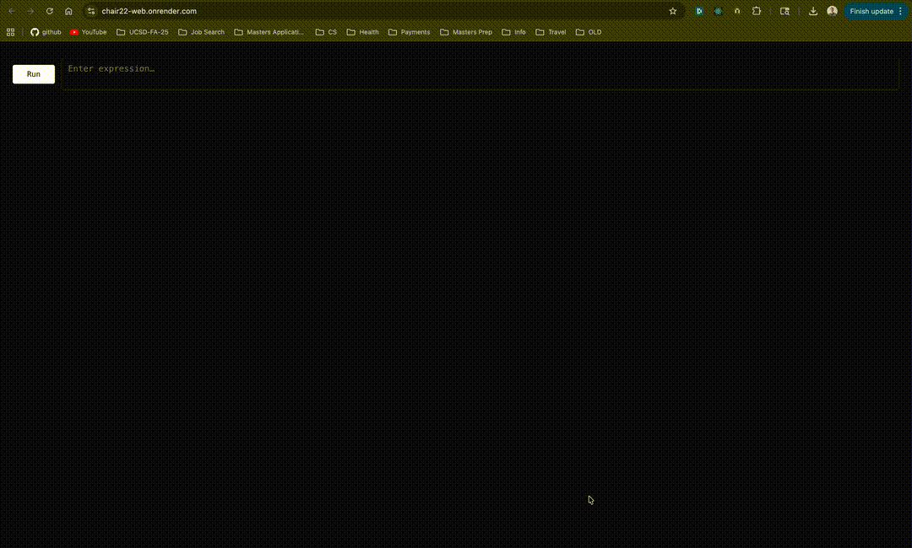

You can view, follow and analyze my work for this and [chair23](https://github.com/vnikonov63/chair23) projects at this [Trello Board](https://trello.com/invite/b/68f1e17cc8973c8fdf027799/ATTIcd69c353aabd81e0c64072ee9248f52970CEABD0/chair22-23)

You can try out my demo on this [website](https://chair22-web.onrender.com/)



## Quick Start

- You can start the server with `cargo run -p server`
- You can start the frontend with `cd client && npm run`
- You can interact with the compiler in the command line with
  - `cargo run -p cli -- -c <input.viva> <output.s> # To generate an assembly file for a given file`
  - `cargo run -p cli -- -e <input.viva> <optionalArg> # To evaluate a given file`
  - `cargo run -p cli -- -g <input.viva> <output.s> <optionalArg> # Combines he use of both modes above`
  - `cargo run -p cli -- -i # To enter the repl mode`
- You can run the tests for the compiler with `cd cli && cargo test`

## Features

## Concrete Syntax

This is the concrete syntax for the input language of my compiler:

```
<type> := Num | Bool | Nothing | Any
<prog> := <defn>* <expr>
<defn> := (fun (<name> (<name> : <type>)*) -> <type> <expr>)
  | (fun (<name> <name>*) <expr>)
<binding> := (<identifier> <expr>)
<expr> :=
  | <number>
  | true
  | false
  | input
  | <identifier>
  | (let (<binding>+) <expr>)
  | (<op1> <expr>)
  | (<op2> <expr> <expr>)
  | (set! <name> <expr>)
  | (if <expr> <expr> <expr>)
  | (block <expr>+)
  | (loop <expr>)
  | (break <expr>)
  | (<name> <expr>*)
  | (cast <type> <expr>)

<op1> := add1 | sub1 | isnum | isbool | print
<op2> := + | - | * | < | > | >= | <= | =
```

## Calling Convention for the Viva is different from System V AMD64 ABI
Consider the code:
```Racket
(fun (f1 a b c)
  (a * b + c))

(fun (f2 a b)
  (= (f1 a 4 b) (f1 b 4 a)))

; main
(block
  (let (dummy1 1) (dummy2 2) (dummy3 3)) 
  (f2 2 3)
)
```
Internally what happens is:
```text
LOW ADDRESS
                ┏━━━━━━━━━━━━━━━━━━━━━━━━━━━━━━━━━━━━━━━━━━━━━━━━━━━━━━━━━━━━━━━━━━━━━━┓
                ┃                              [ IN f1 ]                               ┃
                ┣━━━━━━━━━━━━━━━━━━━━━━━━━━━━━━━━━━━━━━━━━━━━━━━━━━━━━━━━━━━━━━━━━━━━━━┫
                ┃  a = 3                                                               ┃
                ┃  b = 4                                                               ┃
                ┃  c = 2                                                               ┃
                ┃  after_call_f1_2   ← callee returns with jmp [rsp]                   ┃
                ┣━━━━━━━━━━━━━━━━━━━━━━━━━━━━━━━━━━━━━━━━━━━━━━━━━━━━━━━━━━━━━━━━━━━━━━┫
                ┃                              [ IN f2 ]                               ┃
                ┣━━━━━━━━━━━━━━━━━━━━━━━━━━━━━━━━━━━━━━━━━━━━━━━━━━━━━━━━━━━━━━━━━━━━━━┫
                ┃  b = 3                                                               ┃
                ┃  a = 2                                                               ┃
                ┃  after_call_f2     ← return target for both f1 calls                 ┃
                ┣━━━━━━━━━━━━━━━━━━━━━━━━━━━━━━━━━━━━━━━━━━━━━━━━━━━━━━━━━━━━━━━━━━━━━━┫
                ┃                              [ IN MAIN ]                             ┃
                ┣━━━━━━━━━━━━━━━━━━━━━━━━━━━━━━━━━━━━━━━━━━━━━━━━━━━━━━━━━━━━━━━━━━━━━━┫
                ┃  dummy3                                                              ┃
                ┃  dummy2                                                              ┃
                ┃  dummy1                                                              ┃
                ┃  ret_to_runtime   (our_code_starts_here return)                      ┃
                ┗━━━━━━━━━━━━━━━━━━━━━━━━━━━━━━━━━━━━━━━━━━━━━━━━━━━━━━━━━━━━━━━━━━━━━━┛
HIGH ADDRESS
```

## Type System is Organized as a Small Lattice
```text
    Any
   /   \
 Num   Bool
   \   /
  Nothing
```

## Code You Can Run

**9. First Fibonacci Sequence Element with a Given Divisor**

```Racket
(let ((divisor 25) (index 0) (maximum 50) (prev 0) (curr 1) (temp1 0) (temp2 0))
    (if (<= divisor 0)
        -1
        (loop
            (if (<= index maximum)
                (block
                    (set! temp1 curr)
                    (loop
                        (if (> temp1 0)
                            (set! temp1 (- temp1 divisor))
                            (break temp1)
                        )
                    )
                    (if (= temp1 0)
                        (break curr)
                        (block
                            (set! temp2 curr)
                            (set! curr (+ curr prev))
                            (set! prev temp2)
                            (set! index (add1 index))
                        )
                    )
                )
                (break -1)
            )
        )
    )
)
```

**10. Determine whether the given number is perfect**

```Racket
(let ((num 33550336) (curr_sum 1) (curr_index 2) (temp 0) (counter 0))
    (if (<= num 1)
        false
        (loop
            (if (<= (* curr_index curr_index) num)
                (block
                    (set! temp num)
                    (set! counter 0)
                    (loop
                        (if (> temp 0)
                            (block
                                (set! temp (- temp curr_index))
                                (set! counter (add1 counter))
                            )
                            (break temp)
                        )
                    )
                    (if (= temp 0)
                        (block
                            (set! curr_sum (+ curr_sum curr_index))
                            (if (= curr_index counter)
                                (set! curr_sum curr_sum)
                                (set! curr_sum (+ curr_sum counter))
                            )
                            (set! curr_index (add1 curr_index))
                        )
                        (set! curr_index (add1 curr_index))
                    )
                )
                (break (if (= curr_sum num) true false))
            )
        )
    )
)
```
